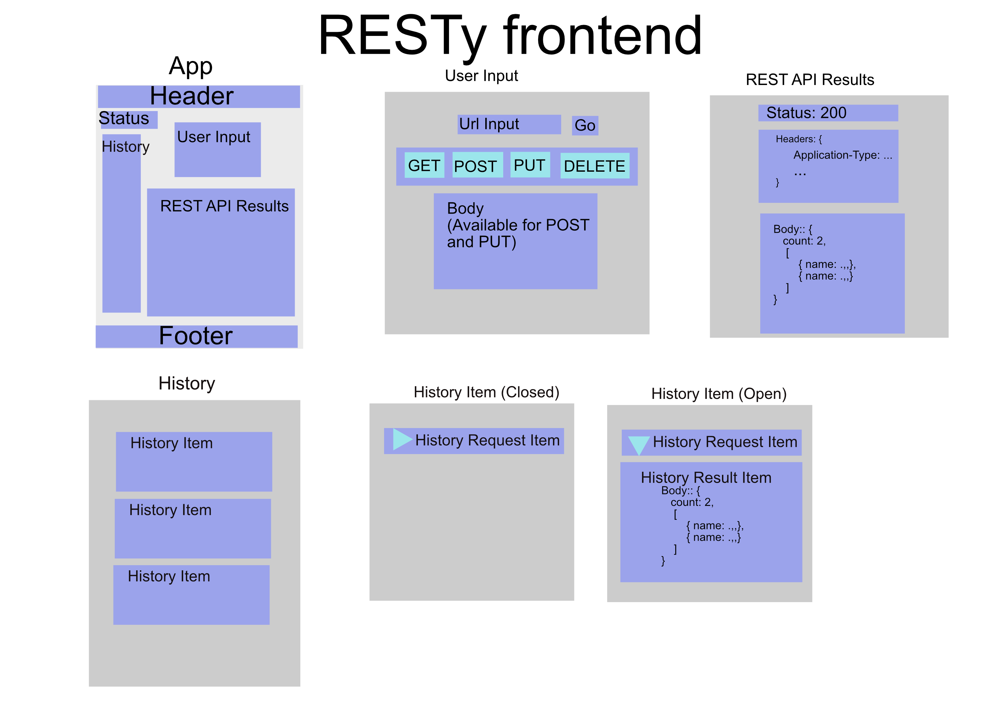

# RESTy

A tester for your REST endpoints.

RESTy will help you test your REST API backend. It will accept your REST endpoint’s URL and JSON body as input and send requests to the REST backend. Then it will log the results for you.

## UML Diagram of the UI

--------------
Github Pages: (https://rmccrear.github.io/26-react-frontend-resty/)[https://rmccrear.github.io/26-react-frontend-resty/]
